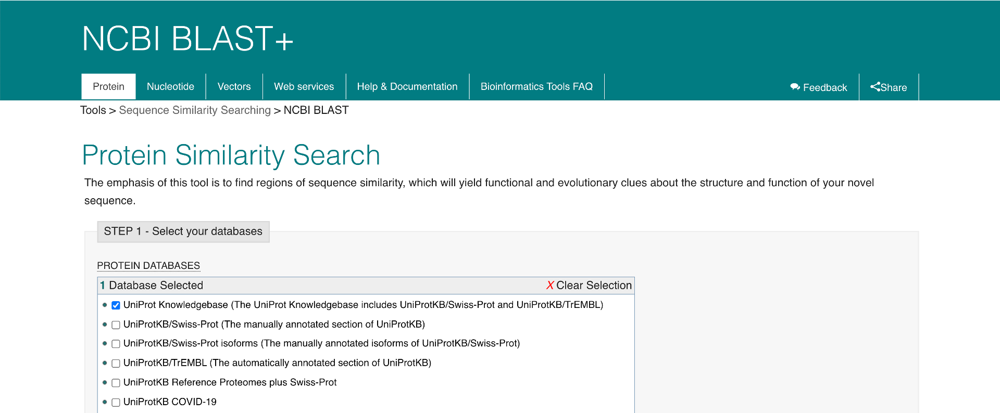

# Usage

## Can I search for more than one protein at a time?

For searching multiple proteins simultaneously, one can perform ‘Batch Search’ in IntAct. One can directly give the input query in the search box provided or can choose to upload a file containing an interested list of proteins. In the sequential steps, Batch search will allow you to choose to resolve the query terms and will fetch you the results.

## The results of my search contain mixed species e.g. human-mouse interactions – why, and how do I remove them?

The data reflects how the authors performed the original experiments. In many cases genes from one species are exogenously expressed in a second, for example a tagged mouse protein is expressed in a human cell line, resulting in _mouse-human_ _interactions_. It is our practice to collate the data as it was observed in the experiment e.g. _human-mouse_, _mouse-rat_ and let the user decide whether to infer _human-human_ or _mouse-mouse_ _interactions_ from these observations. Of course, some of the data is _host-pathogen_, and the mixed species interaction is then valid.

The 'species' folder on the IntAct ftp site \([ftp://ftp.ebi.ac.uk/pub/databases/intact/current/psi25/species/](ftp://ftp.ebi.ac.uk/pub/databases/intact/current/psi25/species/)\) contains species-specific datasets, in PSI-XML2.5 format. These files also contain mixed species interactions.

If you require species-specific data, you should perform the query `species:{your favourite taxID}` on the website and download the data in your format of choice. For example, for interactions involving human proteins, the query would be `species:9606`. It is preferable to use either the taxID or scientific name \(species:homo sapiens\) to avoid unspecific results. `species:human` will also return also interactions of proteins from organisms with the string `human` in their name, such as the human immunodeficiency virus. Please note that with this query you will obtain interactions that involve at least one human protein, but the interacting partner can still be of another species. To search for only those interactions from a single species, use the query `taxidA:{your favourite taxID} AND taxidB: :{your favourite taxID}`

For example, for only human proteins, `taxidA:9606 AND taxidB:9606`.

## I want to look for interactions between pathogen and host proteins, can I find this information in IntAct?

Using the Advanced search options, it is possible to to get host-pathogen interactions. The query format is taxidA:{your favourite taxID} AND taxidB: :{your favourite taxID}, wherein you can choose tax IDs of the host organism and that of the pathogen.

## I submitted a list of 2000 UniProtKB accession numbers via the "search" interface of IntAct, I obtain "0 binary interactions found for search term", why and how do I find results to my search?

The problem is the length of the query. It is difficult to provide a specific limit, because it is defined according to the length in characters that your query consists of, and that depends on the type of identifier you are using. If you submit a list of space-separated UniProtKB accessions, the limit is approximately **700** identifiers in search. This also applies to PSCIQUIC view and PSICQUIC-based Cytoscape import tool.

## I have found no interactions for my protein rat Zap70. How do I find if a homolog/ortholog/paralog with a high degree of sequence similarity has any interactions in the IntAct database?

Go to [www.ebi.ac.uk/tools/sss](https://github.com/intact-portal/intact-portal-documentation/tree/8e742af7316018e9ef02c904bd4a4b7932e7cafc/help/faq/www.ebi.ac.uk/tools/sss/README.md)

Select your Search Engine of choice e.g. NCBI-BLAST.

Click on protein then paste your sequence into the box, make any required changes to the parameters, add your e-mail address and Submit.

You will receive the results in tabular form, with additional hyperlinks through to other databases containing information about this protein. You can see below that, although IntAct  contains no molecular interactions for rat it does for mouse and human

IntAct results can be found in Molecular Interactions cluster. Press on the link to access the data in IntAct

## How do I find if there are interactions involving a specific domain or region in my protein of interest?

IntAct annotates the binding region of interacting proteins at the feature level. Allowing the users to query for binding regions using InterPro accession numbers is something is a work in progress at this moment

## How do I find interactions affected by variant or mutant forms of my protein?

Interactions affected by mutations can be visualized by checking out the “Affected by Mutation” option found in the right side of the results page. Alternatively, you can download the “Mutations” dataset at [here](https://www.ebi.ac.uk/intact/documentation/datasets#mutations)

## Does IntAct record isoform-specific interactions?

Yes, IntAct curators stringently specify the protein isoform or the pro-chain as mentioned by the authors by using appropriate UniProtKB accession number. The user can query using UniProtKB

## Can I find drug-target interactions in IntAct?

Yes, IntAct has captured molecular iteraction of proteins with drugs and other small molecules using appropriate ChEBI accession number. Small molecules list will include entities which are synthetic or modified peptides but not those directly encoded by the genome.

## Can I find interactions between different molecule types in IntAct? \(e.g. protein-DNA interactions\)

Interacting partner\(s\) in IntAct database can be of different molecular types such as proteins, small molecules, nucleic acids, complexes and genes. Based on the type of partner, interactions between protein-protein, protein-DNA and protein-RNA, protein-gene, RNA-RNA, protein-small molecule, protein-macromolecule complex interactions are well documented in IntAct.

## How to link to the IntAct website?

There are currently 5 supported ways to link to the IntAct website

### 1. Interaction tab using a free text query \(MIQL\):

Example:[`http://www.ebi.ac.uk/intact/query/bbc1`](http://www.ebi.ac.uk/intact/query/bbc1)

### 2. Details tab by experiment AC:

Given an experiment AC, one can open the details below \(Please note: this will not show any interaction details but only experiment and respective publication\)

Example: [`http://www.ebi.ac.uk/intact/pages/details/details.xhtml?experimentAc=EBI-768904`](http://www.ebi.ac.uk/intact/pages/details/details.xhtml?experimentAc=EBI-768904)

### 3. Details tab by interaction AC:

Given an interaction AC, one can open the detail view

Example: [`http://www.ebi.ac.uk/intact/interaction/EBI-2307627`](http://www.ebi.ac.uk/intact/interaction/EBI-2307627)

### 4. Interaction given a pair of interactor:

Given two interactors' AC, one can open the interaction detail view, for instance

Example: [`http://www.ebi.ac.uk/intact/pages/details/details.xhtml?binary=EBI-3437,EBI-2750`](http://www.ebi.ac.uk/intact/pages/details/details.xhtml?binary=EBI-3437,EBI-2750)

### 5. Molecule view by interactor AC:

Given an interactor AC, one can open the Molecule view \(Dasty2\), for instance

Example: [`http://www.ebi.ac.uk/intact/molecule/EBI-349905`](http://www.ebi.ac.uk/intact/molecule/EBI-349905)

## Why do I get fewer results when I search IntAct via the PSICQUIC service, than when I search on the IntAct website?

The IntAct PSICQUIC webservice only contains interactions curated by IntAct curators. If you want data curated by external curators in the IntAct environment \(for example MINT or UniProtKB\), or from other IMEx/PSICQUIC data providers, we recommend you look at the PSICQUIC registry \([http://www.ebi.ac.uk/Tools/webservices/psicquic/registry/registry?action=STATUS](http://www.ebi.ac.uk/Tools/webservices/psicquic/registry/registry?action=STATUS)\). All PSICQUIC data providers should support MITAB2.5, but if you wish to use another format you need to first check which format each data provider supports e.g. REST URL/formats\).

Here you have a list with the code for each format: [https://github.com/MICommunity/psicquic/blob/wiki/PsicquicSpec\_1\_3\_Rest.md\#formats](https://github.com/MICommunity/psicquic/blob/wiki/PsicquicSpec_1_3_Rest.md#formats)

For more information, please have a look at our PSICQUIC GitHub project page: [href="https://github.com/MICommunity/psicquic](https://github.com/MICommunity/psicquic)

Here you have a list with the code for each format:  
[https://github.com/MICommunity/psicquic/blob/wiki/PsicquicSpec\_1\_3\_Rest.md\#formats](https://github.com/MICommunity/psicquic/blob/wiki/PsicquicSpec_1_3_Rest.md#formats)

For more information, please have a look at our PSICQUIC GitHub project page:  
[href="https://github.com/MICommunity/psicquic](https://github.com/MICommunity/psicquic)

